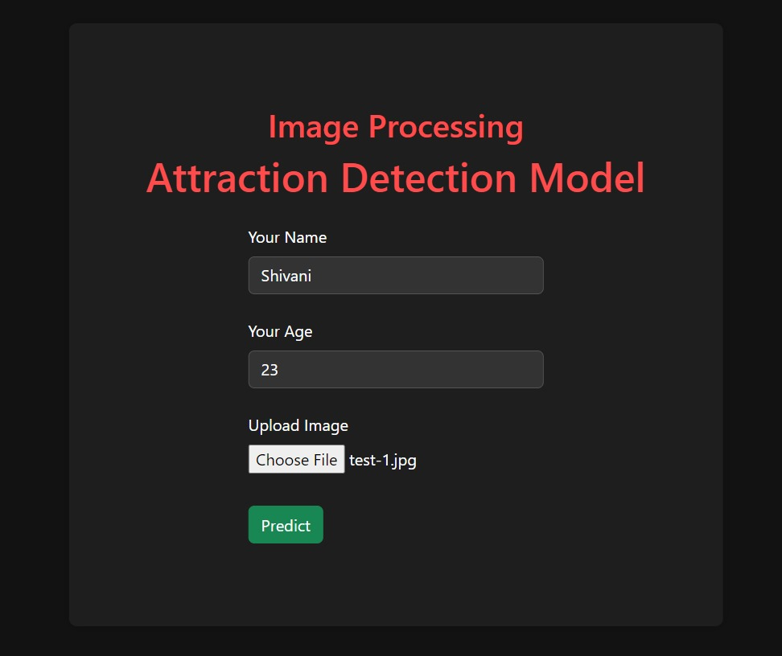
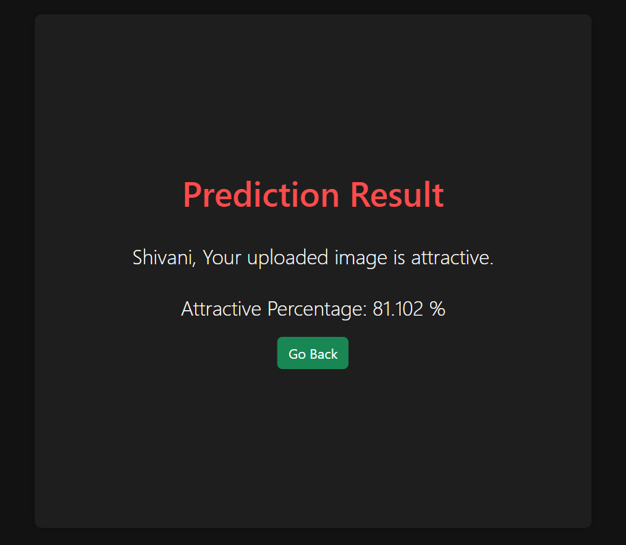
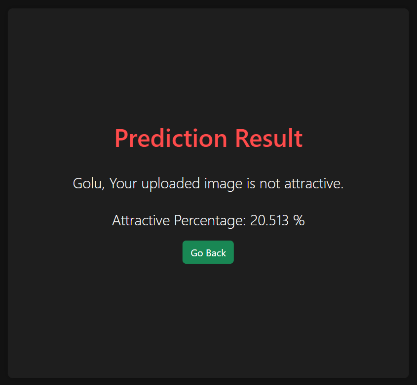

<h1 align='center'>💥 Faces Attraction Detection Model 💥</h1>

### :zap: **GOAL** 

- The aim of the project is doing image processing and prediction of faces attraction of images.

### :zap: **DATASET** 

- https://www.kaggle.com/datasets/jessicali9530/celeba-dataset

### :zap: **DESCRIPTION**

To analyze the dataset of the Celeba Dataset and build and train the model on the basis of different features and variables.

There are 40 features and 202599 entries in this dataset.

| Feature                | Description          | Example Values       |
|------------------------|----------------------|----------------------|
| 5_o_Clock_Shadow       | Presence of a shadow near the chin and jawline, resembling a five o'clock shadow | 0 (Absent), 1 (Present) |
| Arched_Eyebrows        | Eyebrows with a curved or arched shape  | 0 (No), 1 (Yes)       |
| Attractive             | Aesthetic appeal or attractiveness of the individual | 0 (No), 1 (Yes)       |
| Bags_Under_Eyes        | Dark circles or puffiness under the eyes | 0 (No), 1 (Yes)       |
| Bald                   | Absence of hair on the scalp   | 0 (No), 1 (Yes)       |
| Bangs                  | Hair styled to fall across the forehead   | 0 (No), 1 (Yes)       |
| Big_Lips               | Full or prominent lips  | 0 (No), 1 (Yes)       |
| Big_Nose               | Large or prominent nose  | 0 (No), 1 (Yes)       |
| Black_Hair             | Hair color is black  | 0 (No), 1 (Yes)       |
| Blond_Hair             | Hair color is blond  | 0 (No), 1 (Yes)       |
| Blurry                 | Image is blurry or out of focus  | 0 (No), 1 (Yes)       |
| Brown_Hair             | Hair color is brown  | 0 (No), 1 (Yes)       |
| Bushy_Eyebrows         | Thick or dense eyebrows  | 0 (No), 1 (Yes)       |
| Chubby                 | Round or plump face or body  | 0 (No), 1 (Yes)       |
| Double_Chin            | Extra layer of fat under the chin  | 0 (No), 1 (Yes)       |
| Eyeglasses             | Wearing glasses or spectacles  | 0 (No), 1 (Yes)       |
| Goatee                 | Facial hair in the area of the chin  | 0 (No), 1 (Yes)       |
| Gray_Hair              | Hair color is gray or silver  | 0 (No), 1 (Yes)       |
| Heavy_Makeup           | Excessive or noticeable makeup  | 0 (No), 1 (Yes)       |
| High_Cheekbones        | Prominent cheekbones  | 0 (No), 1 (Yes)       |
| Male                   | Gender is male  | 0 (No), 1 (Yes)       |
| Mouth_Slightly_Open    | Mouth is slightly open  | 0 (No), 1 (Yes)       |
| Mustache               | Facial hair on the upper lip  | 0 (No), 1 (Yes)       |
| Narrow_Eyes            | Eyes are narrow or small  | 0 (No), 1 (Yes)       |
| No_Beard               | Absence of facial hair  | 0 (No), 1 (Yes)       |
| Oval_Face              | Face shape is oval  | 0 (No), 1 (Yes)       |
| Pale_Skin              | Skin color is pale or light  | 0 (No), 1 (Yes)       |
| Pointy_Nose            | Nose has a pointed or sharp tip  | 0 (No), 1 (Yes)       |
| Receding_Hairline      | Hairline is receding or thinning  | 0 (No), 1 (Yes)       |
| Rosy_Cheeks            | Cheeks have a rosy or flushed appearance  | 0 (No), 1 (Yes)       |
| Sideburns              | Facial hair along the sides of the face  | 0 (No), 1 (Yes)       |
| Smiling                | Expression of a smile  | 0 (No), 1 (Yes)       |
| Straight_Hair          | Hair texture is straight  | 0 (No), 1 (Yes)       |
| Wavy_Hair              | Hair texture is wavy  | 0 (No), 1 (Yes)       |
| Wearing_Earrings       | Wearing earrings or ear jewelry  | 0 (No), 1 (Yes)       |
| Wearing_Hat            | Wearing a hat or head covering  | 0 (No), 1 (Yes)       |
| Wearing_Lipstick       | Wearing lipstick or lip makeup  | 0 (No), 1 (Yes)       |
| Wearing_Necklace       | Wearing a necklace or neck jewelry  | 0 (No), 1 (Yes)       |
| Wearing_Necktie        | Wearing a necktie or neckwear  | 0 (No), 1 (Yes)       |
| Young                  | Indicates a youthful appearance or age | 0 (No), 1 (Yes)       |

### :zap: **OUTPUTS**

<table align='center'>
  <tr align='center'>
    <td align='center'>
      
    </td>
    <td align='center'>
      
    </td>
    <td align='center'>
      
    </td>
  </tr>
  <tr align='center'>
    <td align='center'>
      
    </td>
    <td align='center'>
      
    </td>
    <td align='center'>
      
    </td>
  </tr>
</table>

  <h3>Show some &nbsp;❤️&nbsp; by &nbsp;🌟&nbsp; this repository!</h3>
   <em><b>I love connecting with different people</b> so if you want to say <b>hi, I'll be happy to meet you more!</b> :)</em>

